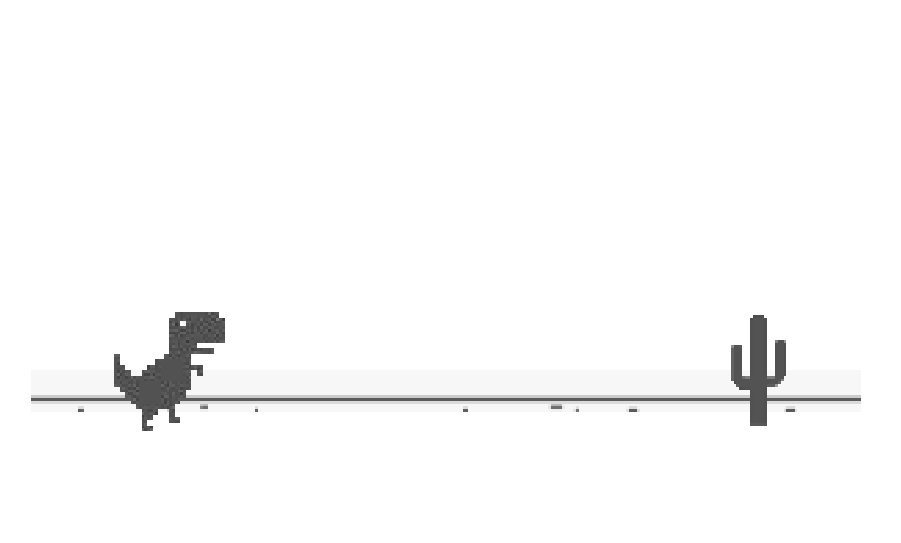
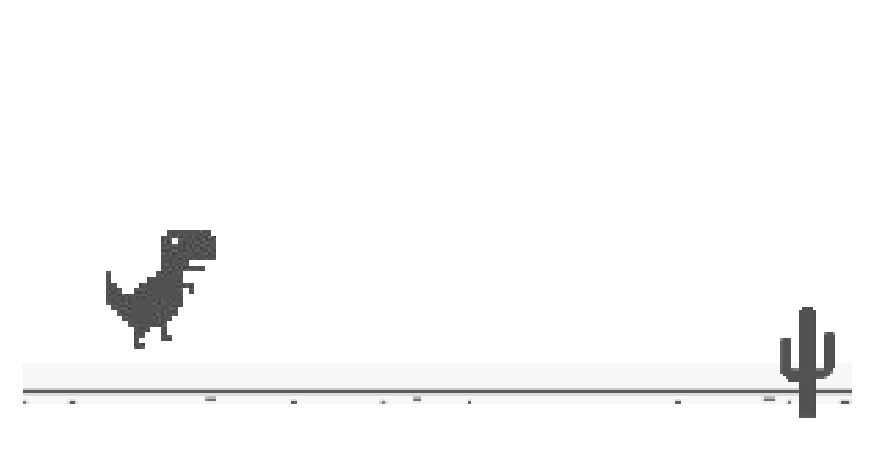
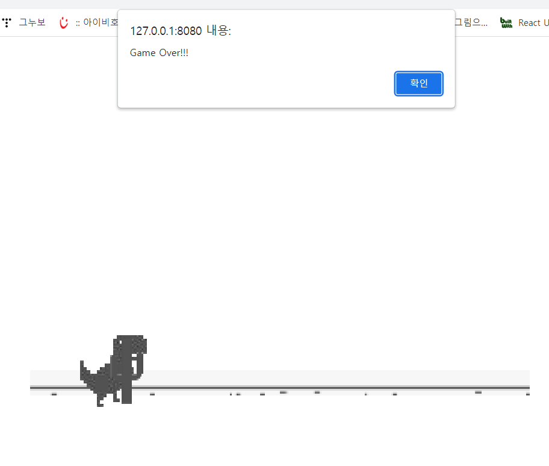

# JavaScript를 이용한 공룡아 달려라! 입니다.

<h2>보고서</h2>
<table>
  <h2>5팀</h2>
  <tr>
    <td>
      직책
    </td>
    <td>
      이름
    </td>
    <td>
      학과
    </td>
    <td>
      학년
    </td>
  </tr>
  
  <tr>
    <td>
      팀장
    </td>
    <td>
      이승호
    </td>
    <td>
      컴퓨터공학과
    </td>
    <td>
      4
    </td>
  </tr>
  
  <tr>
    <td>
      팀원
    </td>
    <td>
      배정태
    </td>
    <td>
      컴퓨터공학과
    </td>
    <td>
      4
    </td>
  </tr>
  

   <tr>
    <td>
      팀원
    </td>
    <td>
      김대현
    </td>
    <td>
      컴퓨터공학과
    </td>
    <td>
      4
    </td>
  </tr>
  
   <tr>
    <td>
      팀원
    </td>
    <td>
      이진욱
    </td>
    <td>
      컴퓨터공학과
    </td>
    <td>
      4
    </td>
  </tr>
  
  
</table>

 
<h2>요약</h2> 

<h3>
JavaScript를 이용해 사용자가 마우스 버튼 클릭해 공룡이 점프를 하여 랜덤으로 다가오는 장애물을 피하는 게임입니다
</h3>

 

  <h3>내용</h3>
  <h4>
    (1) visual studio로 코드를 실행 시킵니다. 
    (2) 사용자는 화면에 나타나는 공룡이 장애물을 잘 피할수 있도록 마우스로 컨트롤 해줍니다. 
    (3) 사용자가 장애물을 피할 때 마다 랜덤으로 장애물이 계속 생성이 됩니다. 
    (4) 장애물과 충돌하면 Game Over를 출력하고 다시 마우스를 클릭시 재 시작이 됩니다. 
  </h4>

<h3>실행</h3>
  <h4>
    
    
    
  </h4>

  <h3>동영상 링크</h3>
  <h4>
   https://youtu.be/d3HHF6NGcrY
  </h4>
  <h4> 참고 문헌</h4>
  </h1>https://www.youtube.com/watch?v=55anP6TWiOw&t=1896s - 소스코드 </h1> 
  </h1>https://velog.io/@takeknowledge/%EB%A1%9C%EC%BB%AC%EC%97%90%EC%84%9C-CORS-policy-%EA%B4%80%EB%A0%A8-%EC%97%90%EB%9F%AC%EA%B0%80-%EB%B0%9C%EC%83%9D%ED%95%98%EB%8A%94-%EC%9D%B4%EC%9C%A0-3gk4gyhreu - 실행 오류 해결 방안 </h1>  
  </h1>https://macchoi.github.io/App/Trex/index.html - 실제 실행 </h1> 
  

